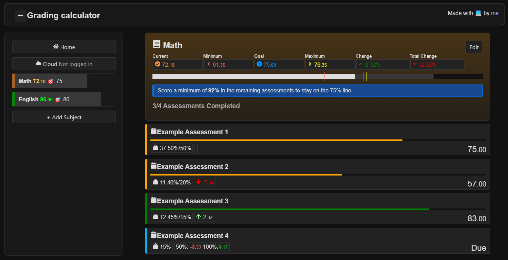

# Grading calculator react

## Access it [here](https://skybird23333.github.io/grading-calculator-react/#/)

Save and track your mark progression across different assessments. I made this to learn React and for my own usage.

This is a work in progress

Features:
- Looks ok
- **Calculate grading based off assessments that were completed**
- **Calculate minimum marks required to stay on the goal for incomplete assessments**
- **Otherwise, the maximum marks you can get for your subject**
- **Show how assessments you have done have affected your current mark**
- **Show how future assessments could possibly impact your current mark**
- Sync your data across devices(via supabase)
- Has a progress bar
- Will not threaten to kill you if you misinput
- A different progress bar which shows different assessments as well as what you have scored(soon)
- Being able to save and come back later(done)
- Show the highest weighting assessments(soon)
- Show stuff when hover over progress bar(soon)
- Clean, organised, readable code(soon)

### Poopy code alert
I made this very very back when I started to learn how to use react. Plus class syntax was still a thing back then. If you venture into some very inconsistent code styles make sure to git blame and see when it was written.